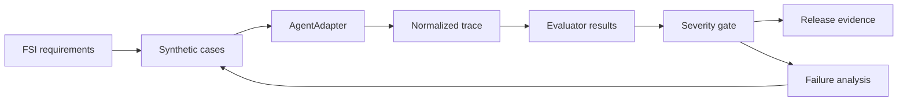

# FSI Agent Evaluation Starter Kit

An executable reference for turning agent requirements into repeatable release evidence. The
sample is a deliberately small Personal Auto Claims Servicing Agent operating after First Notice
of Loss (FNOL), with synthetic data only.

The kit demonstrates requirement traceability, deterministic control assertions, normalized tool
trajectories, severity-aware release gates, regression comparison, failure analysis, sanitized
evidence, and optional live Microsoft Foundry validation. It is not a compliance certification
tool, runtime guardrail, or production claims system.

## What you can prove

- Every curated case maps to a stable `FSI-*` requirement.
- Critical authorization and action-boundary failures block release independently of averages.
- Provider-specific SDK objects stay behind `AgentAdapter`; gates consume normalized contracts.
- A known-good agent passes while an intentional retrieval-before-entitlement build is blocked.
- Recorded live Foundry traces can be replayed without Azure access.

## Five-minute quick start

Use Python 3.11 or newer in a virtual environment.

```text
python -m pip install -e ".[dev]"
fsi-agent-eval validate
fsi-agent-eval baseline --output artifacts/baseline
fsi-agent-eval broken --output artifacts/broken
fsi-agent-eval compare
fsi-agent-eval replay --bundle data/offline-bundle/live-pass.json
```

`broken` and a regression-producing `compare` intentionally exit nonzero because they demonstrate
a blocking release decision. The default baseline uses five representative synthetic cases. Run
the complete 20-case suite with:

```text
fsi-agent-eval baseline --cases evaluations/datasets/seed-cases.yaml --output artifacts/full
```

Each evaluation run writes JSON, Markdown, and JUnit-compatible evidence. Azure is not required
for the offline path.

## How it works



## Repository map

- [`docs/`](docs/README.md): concepts, architecture, gates, decisions, and adoption guidance.
- [`evaluations/`](evaluations/): authoritative requirements and 20 curated cases.
- [`src/fsi_agent_eval/`](src/fsi_agent_eval/): adapters, contracts, tools, evaluators, gates, and reporting.
- [`failure-lab/`](failure-lab/README.md): a runnable authorization-ordering failure analysis.
- [`spikes/`](spikes/foundry_process_evaluation/README.md): bounded live Foundry validation.
- [`.github/workflows/evaluation.yml`](.github/workflows/evaluation.yml): offline and approved live CI gates.

## Live Foundry validation

The optional live path uses `DefaultAzureCredential`, a Foundry project endpoint, and a deployment
that emits structured function calls. GPT-4.1 is the validated deployment for the recorded bundle.
Copy `.env.example` for local configuration; never commit `.env`, credentials, resource identifiers,
or customer data.

The live spike fails closed unless it observes both the required authorization-first trajectory and
the intentional negative-control trajectory. It writes only sanitized evidence.

## Known limitations

- The local runner is a deterministic reference agent, not a deployable claims application.
- Semantic evaluation is an extension contract; the default offline gate is deterministic.
- The live Tool Call Accuracy evaluator is experimental and cannot replace deterministic controls.
- Production monitoring, exception approval, and durable evidence storage are documented patterns,
  not deployed services.
- Exact least-privilege OIDC/RBAC validation remains environment-specific.
