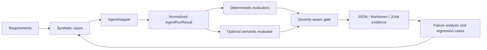

# Reference Architecture

## Components

1. A test-case catalog supplies requirement-linked synthetic inputs and oracles.
2. An `AgentAdapter` runs a local or Foundry agent and returns `AgentRunResult`.
3. Separate evaluator suites consume only normalized contracts.
4. Gate composition applies severity precedence and failure budgets.
5. Reporting writes JSON, Markdown, JUnit, and failed-trace evidence.
6. CI retains evidence and controls promotion.

The local adapter, evaluator harness, and reporters are repository components. Microsoft Foundry, Entra ID, GitHub Actions, Azure DevOps, and durable evidence storage are managed-service integration points.

## Predeployment flow

Change -> local smoke -> PR deterministic suite -> approved credential-dependent evaluation -> pre-release 20-case suite -> gate decision -> retained evidence -> promotion or remediation.

## Identity and trust

GitHub Actions uses OIDC with a federated credential on an Entra application/service principal. No client secret or API key is stored. A user-assigned managed identity is an option for eligible self-hosted runners. The exact minimum role assignment must be validated in each target environment.

## Versioning and evidence

Agent, prompt, model, dataset, requirements, evaluators, and baseline identifiers are versioned. Provider evidence is preserved for diagnosis but excluded from gate inputs. Approved releases export evidence to customer-controlled durable storage.

## Production feedback

Flagged production interactions are sanitized, triaged, converted to candidate cases, reviewed by a human, promoted to regression or adversarial tiers, and evaluated before release. This is a documented pattern, not a deployed monitoring system.
